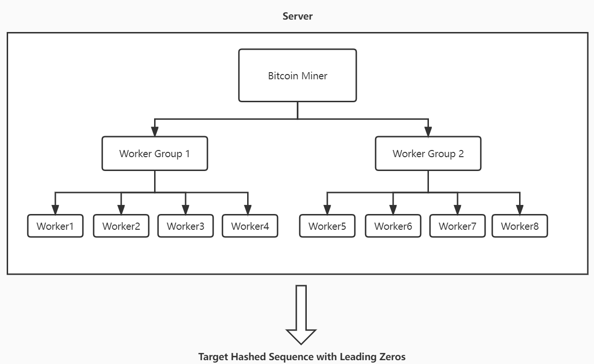

# [COP5615] DOSP Project 1 BitCoin Miner

## Team Members
- Zhaoyang Chen (UFID: 90137235)

## Architecture Overview
The architecture consist of a single boss(server) and multiple workers. Individual component consist of following actors:  
	1.	Worker group  
	2.	Workers  

Architecture of a single server is as follows:  


### How did we achieve distribution?
By selecting the number of work groups, the server will generate tasks for multiple workers to find a specific hash string simultaneously. The effiency of the task can be measured by the ratio of CPU time to real time (actual time).

The following table depits the performace measure for the given number of workers (Number of group * 4):
|GroupSize| WorkUnit | Ratio of CPU time to Real time |
|--|----------|----------------------------------|
|\ | 1        | 0.7~1.0                            |
|\ | 2        | 1.89                               |
|\ | 3        | 2.88                               |
|1 | 4        | 3.82                               |
|2 | 8        | 3.88                               |
|3 | 12       | 3.83                               |
|4 | 16       | 3.88                               |
|5 | 20       | 3.84                               |
|6 | 24       | 3.84                               |
 
According to the above observations, our best WorkUnit value is approximately 4~12.

### Steps to run the program
```
38> c(bitcoinminer). 
{ok,bitcoinminer}
39> c(boss).        
{ok,boss}
40> boss:start(5,1).
```

### Some running output of the program
```
38> c(bitcoinminer). 
{ok,bitcoinminer}
39> c(boss).        
{ok,boss}
40> boss:start(5,1).
num of group are 1
workers generated 4
ok
Code: czyWjkdSydpalSx           HashCode: 00000d11149c2c2ee7b739ce201c1261713b73e99c02350e3f7c4ad88f10108a
CPU time: 71.556 seconds        Real time: 18.705 seconds
Ratio is 3.8255012028869286 
41> boss:start(5,2).
num of group are 2
workers generated 8
ok
Code: czyyehDwStw3sLb           HashCode: 00000d42688bc2d5e082cdfb465bf84df862624dc624c1b347329433b6d75038
CPU time: 87.255 seconds        Real time: 22.45 seconds
Ratio is 3.8866369710467703 
42> boss:start(5,3).
num of group are 3
workers generated 12
ok
Code: czyYIfbPjna1R0O           HashCode: 00000879e52531d9449e328bded18e6717f4a067e6cbb96f73bfa896589a1cef
CPU time: 9.446 seconds Real time: 2.462 seconds
Ratio is 3.8367181153533707 
43> boss:start(5,4).
num of group are 4
workers generated 16
ok
Code: czy6FoiHB8Zdmo5           HashCode: 000000316ab245e87f2589aed2044d7960874096a5b2b207cf5b87e4bb0d25c5
CPU time: 30.682 seconds        Real time: 7.895 seconds
Ratio is 3.886257124762508 
44> boss:start(5,5).
num of group are 5
workers generated 20
ok
Code: czyAtMTvnZHQ9JY           HashCode: 000008370354b03e0fbd8afe02a857352e9e2bec245e2eebc6e271c0029f2497
CPU time: 22.393 seconds        Real time: 5.824 seconds
Ratio is 3.8449519230769234 
45> boss:start(5,6).
num of group are 6
workers generated 24
ok
Code: czy/Ta+ahjnVAcG           HashCode: 0000057467a8a6901a767e77e4d9653e7f987749e329b07ba83e883d501ad77f
CPU time: 16.676 seconds        Real time: 4.334 seconds
Ratio is 3.847715736040609 


```